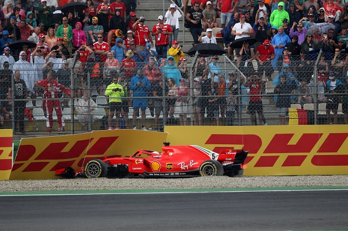

```{r setup, include=FALSE}
knitr::opts_chunk$set(cache = TRUE, message = FALSE, warning = FALSE)


#  ioslides_presentation:
#    css: style.css
#    incremental: yes
#  slidy_presentation:
#    incremental: yes
#editor_options:
#  chunk_output_type: inline

```

## Overview {data-background-video="background.mp4"}

Cercheremo di rispondere a varie domande, da quelle più classiche ad altre più specifiche.
Inolte analizzeremo particolari situazioni.

>* Posizione dei circuiti 
>* Il pit stop più corto 
>* Campionato 2018
>* Hockenheim 2018
>* Era turbo-ibrida


## Il Dataset

Il dataset è composto da diverse tabelle, unibili tra loro attraverso opportune chiavi (ID).
Ogni tabella contiene specifiche informazioni: circuiti, costruttori, piloti, tempi sul giro, pit stops, qualifiche, gare, campionati dal 1950 al 2021.


```{r, echo=FALSE}
library(readr)
library(dplyr)
library(tidyr)
library(ggplot2)
library(modelr)
library(tidyverse)
library(gganimate)
library(sf)
library(plotly)
library(rnaturalearth)
library(rnaturalearthdata)
library(maps)
library(mapdata)
library(grid)
library(rworldmap)


circuits = read_csv("csv/circuits.csv")
constructor_results = read_csv("csv/constructor_results.csv")
constructor_standings = read_csv("csv/constructor_standings.csv")
constructors = read_csv("csv/constructors.csv")
driver_standings = read_csv("csv/driver_standings.csv")
drivers = read_csv("csv/drivers.csv")
lap_times = read_csv("csv/lap_times.csv")
pit_stops = read_csv("csv/pit_stops.csv")
qualifying = read_csv("csv/qualifying.csv")
races = read_csv("csv/races.csv")
results = read_csv("csv/results.csv")
seasons = read_csv("csv/seasons.csv")
status = read_csv("csv/status.csv")

```

## Dove si svolge la Forumula 1

<section>
<br>
Esaminiamo dove si trovano tutti i circuiti che hanno o che stanno attulamente ospitando la Formula 1

```{r, echo=FALSE}

world <- ne_countries(scale = "medium", returnclass = "sf")
#class(world)

lat_cir = c(26.0325, 44.3439, 37.2270, 41.5700, 43.7347, 40.3725, 43.2506, 47.2197, 52.0786, 47.5789, 50.4372,52.3888, 45.6156, 43.4057, 1.2914,34.8431,30.1328,19.4042,-23.7036,-37.8497,21.5433,24.46720)
lng_cir = c(50.5106, 11.71670, -8.62670, 2.261110, 7.42056,49.8533, 5.791670, 14.7647,-1.016940, 19.2486, 5.97139, 4.54092, 9.28111, 39.9578, 103.864,136.541,-97.6411,-99.0907,-46.6997,144.968,39.1728,54.603100)

all_sites <- data.frame(longitude = circuits$lng, latitude = circuits$lat)
sites <- data.frame(longitude = lng_cir, latitude = lat_cir)

ggplot(data = world) +
    geom_sf() +
    geom_point(data = all_sites, aes(x = longitude, y = latitude), size = 3, shape = 23, fill = "darkred") +
    xlab("Longitude") + ylab("Latitude") +
    ggtitle("Mappa dei circuiti") 

```
</section>

<section>
<br>
Tutti i circuiti della stagione 2021

```{r, echo=FALSE}
#circuiti di questa stagione (2021)

ggplot(data = world) +
    geom_sf() +
    geom_point(data = sites, aes(x = longitude, y = latitude), size = 3, shape = 23, fill = "darkred") +
    xlab("Longitude") + ylab("Latitude") +
    ggtitle("Mappa dei circuiti 2021")

```
</section>
<section>
<br>
Circuiti europei 2021

```{r, echo=FALSE}
world <- ne_countries(scale = "medium", returnclass = "sf")

lat_circ = c( 44.3439, 37.2270, 41.5700, 43.7347, 43.2506, 47.2197, 52.0786, 47.5789, 50.4372,52.3888, 45.6156, 43.4057 )
lng_circ = c( 11.71670, -8.62670, 2.261110, 7.42056, 5.791670, 14.7647,-1.016940, 19.2486, 5.97139, 4.54092, 9.28111, 39.9578)

ue_sites <- data.frame(longitude = lng_circ, latitude = lat_circ)

ue <- st_crop(world, xmin = -20, xmax = 45, ymin = 30, ymax = 73)
ggplot() + geom_sf(data = ue) + theme_bw()+
    geom_point(data = ue_sites, aes(x = longitude, y = latitude), size = 3, shape = 23, fill = "darkred") +
    xlab("Longitude") + ylab("Latitude") +
    ggtitle("Circuiti europei")


```
</section>
<section>
<br>
La maggior parte dei circuiti che hanno e che stanno ospitanto la Formula 1 è in Europa.
</section>

## Pit stops
<section>
I 10 migliori pit stop della storia

```{r, echo=FALSE}

pit <- merge(merge(pit_stops, races, by = "raceId"), drivers, by = "driverId")

pit %>% 
  arrange(milliseconds) %>% 
  head(10) %>% 
  select(milliseconds, name, date, number, forename , surname)
```
</section>
<section>
```{r, echo=FALSE}
pit %>% 
  arrange(desc(raceId)) %>% 
  filter(raceId == 1029) %>% 
  arrange(milliseconds) %>% 
  select( milliseconds, date, name, driverRef) %>% 
  head(5)


```
</section>
<section>
>- I migliori 4 sono nel 2011, i migliori 10 sono stati fatti solo in 3 piste
>- Maldonado nel 2011 era alla Williams
>- Il migliore  dovrebbe essere stato fatto il 17 novembre in Brasile da red bull con 1.82
>- Registra il tempo di tutta la pitlane, non solo del cambio gomme
>- Dal 2010 il Refueling è stato vietato
</section>

## Campionato 2018
<section>
<br>
```{r, echo=FALSE}
#join e tabella filtrata
campionato <- merge( merge(driver_standings, races, by = "raceId"), drivers, by = "driverId")
camp2018 <- campionato %>% 
  select(points, position, wins, year, round, name, date, driverRef)  %>% 
  filter(year == 2018) %>% 
  arrange(round)

#plottiamo i risultati
ggplot(camp2018, aes(x = round, y = points, color = driverRef)) +
  geom_point()+
  geom_line(linetype = "dashed")

```
</section>
<section>
```{r, echo=FALSE}
top <- camp2018 %>% 
  filter(round == 21) %>% 
  arrange(desc(points)) %>% 
  filter(points > 65) %>% 
  select(points, position, wins, driverRef)
top


#solo top 3 (Mercedes, Ferrari, Red Bull)
#non funziona , non da i punti di ogni gara per pilota
#ctrl + shift + c

# camp2018 %>%
#   filter(driverRef == c("hamilton","vettel","raikkonen","max_verstappen","bottas","ricciardo")) %>%
#   ggplot( aes(x = round, y = points, color = driverRef)) +
#   geom_line(linetype = "dashed")+
#   geom_point() +
#   ylab("points") +
#   scale_x_continuous("round", labels = round, breaks = c(0,1,2,3,4,5,6,7,8,9,10,11,12,13,14,15,16,17,18,19,20,21))

```


Possiamo notare una grande differenza di prestazioni, e quindi di punti, tra i primi 6 piloti e il resto della griglia.
Questi piloti fanno parte di solo 3 squadre: Mercedes, Ferrari, Red Bull.
</section>

## Più nel dettaglio 

<section>
>Analizziamo le differenze tra primo e il secondo (Hamilton e Vettel). 
>E tra compagni di squadra (Mercedes: Hamilton e Bottas , Ferrari: Vettel e Raikkonen)

</section>

<section>
<br>
Hamilton vs Vettel
```{r, echo=FALSE}
 
risGare <- merge( merge( merge( merge(results, races, by = "raceId"), drivers, by = "driverId"), constructors, by = "constructorId") , status, by = "statusId")

camp2018 %>% 
  filter(driverRef == c("hamilton", "vettel")) %>% 
  ggplot(aes(x = round, y = points, color = driverRef)) +
    geom_point() +
    geom_line(linetype = "dashed") +
    scale_y_continuous("points", breaks = c(0,50,100,150,200,250,300,350,400)) +
    scale_x_continuous("round", labels = round, breaks = c(0,1,2,3,4,5,6,7,8,9,10,11,12,13,14,15,16,17,18,19,20,21)) 

```
</section>
<section>
<br>
Linear Regression
```{r, echo=FALSE}

lr2018 <- camp2018 %>% 
  filter(driverRef == c("hamilton", "vettel")) 
modPTRO = lm(points ~ round, data = lr2018)

# plot observed and predicted values
lr2018 = add_predictions(lr2018, modPTRO) 
ggplot(lr2018, aes(x = round, y = points, color = driverRef)) +
  geom_point(aes(y = points)) + # observed values
  geom_line(aes(y = pred), colour = "red") # predicted values
```
</section>
<section>
<br>
Mettiamo a grafico i residui
```{r, echo=FALSE}

# add and plot residuals
lr2018 = add_residuals(lr2018, modPTRO)
ggplot(lr2018, aes(round, resid)) + 
  geom_ref_line(h = 0) +
  geom_point()
```
</section>
<section>
Vediamo nel dettaglio i residui e la qualità del modello
```{r, echo=FALSE}
# sort by residuals
lr2018 %>%
  filter(round == 21) %>% 
  arrange(desc(resid)) %>% 
  select(points, wins, round, driverRef, pred, resid) 


# remove predictions and residulas
lr2018 = select(lr2018, -resid, -pred)

# compute model quality
corPTRO = cor(lr2018$points, lr2018$round)
quality = list()
quality$PFRO = corPTRO^2
quality

```
</section>
<section>
<br>
Vettel vs Raikonnen
```{r, echo=FALSE}
# camp2018 %>% 
#   filter(driverRef == c("raikkonen", "vettel")) %>% 
#   ggplot(aes(x = round, y = points, color = driverRef)) +
#     geom_point() +
#     geom_line(linetype = "dashed") +
#     scale_y_continuous("points", breaks = c(0,50,100,150,200,250,300,350,400)) +
#     scale_x_continuous("round", labels = round, breaks = c(0,1,2,3,4,5,6,7,8,9,10,11,12,13,14,15,16,17,18,19,20,21)) 
#  


risGare %>% 
  filter(constructorRef == "ferrari") %>% 
  filter(year == 2018) %>% 
  ggplot(aes(x = round, y = points, color = driverRef)) +
    geom_point() +
    geom_line() +
    scale_x_continuous("round", labels = round, breaks = c(0,1,2,3,4,5,6,7,8,9,10,11,12,13,14,15,16,17,18,19,20,21)) 
 
```
</section>
<section>
<br>
Hamilton vs Bottas
```{r, echo=FALSE}

risGare %>% 
  filter(year == 2018) %>% 
  filter(constructorRef == "mercedes") %>% 
  ggplot( aes(x = round, y = points, group = driverRef, color = driverRef) ) +
  geom_point() +
  geom_line() +
  scale_x_continuous("round", labels = round, breaks = c(0,1,2,3,4,5,6,7,8,9,10,11,12,13,14,15,16,17,18,19,20,21))
  #facet_wrap(~ driverRef)
```
</section>
<section>
<br>
Decisamente più evidente la migliore continuità di prestazione di Hamilton su Bottas, soprattutto nella seconda metà di stagione.
Tra Vettel e Raikonnen La differenza è dovuta a singola ottime prestazioni del tedesco, e più DNF (Non ha concluso la gara)  per il finlandese.
</section>
<section>
<br>
Differenza in punti
```{r, echo=FALSE}
top %>% 
  mutate(diff_con_compagno = ifelse(driverRef == "hamilton", 408-247, 
                                ifelse(driverRef == "vettel", 320-251,"-")))

```
</section>

<section>
>Nella lotta tra Hamilton e Vettel per il titolo, notiamo che i punti dei due piloti si distanziano sempre di più a partire dalla gara 11, dove Vettel non ottiene nessun punto. Il tutto è dovuto ad un errore del pilota che va a muro nel gran premio della Germania, ad Hockenheim.

</section>

<section>
  
</section>

<section>
> Per quanto riguarda la lotta tra compagni di squadra, in mercedes la differenza di prestazione è decisamente più marcata che in ferrari, come si può anche notare dalla tabella finale.

</section>

## Hockenheim 2018
<section>
>Andiamo ad analizzare più nel dettaglio questa singola gara

</section>

<section>
<br>
Posizione in griglia e posizione finale
```{r, echo=FALSE}
#Arrivo

risGare %>% 
  filter(year == 2018) %>% 
  filter(round == 11) %>%
  arrange(desc(points)) %>% 
  select(grid, position, points, status , driverRef, constructorRef) 
```
</section>

<section>
<br>
Andamento gara di Hamilton
```{r, echo=FALSE}
#Andamento gara 

lap_times %>%
  filter(raceId == 999) %>% 
  filter(driverId == 1 ) %>% 
  ggplot( aes(x = lap, y = position) ) +
  geom_point(color = "green3") +
  geom_line(color = "green3") +
  scale_x_continuous("laps", labels = round, breaks = c(0,20,40,60,67))
```
</section>

<section>
<br>
Andamento gara di Vettel
```{r, echo=FALSE}
lap_times %>%
  filter(raceId == 999) %>% 
  filter(driverId == 20 ) %>% 
  ggplot( aes(x = lap, y = position) ) +
  geom_point(color = "red3") +
  geom_line(color = "red3")+
  scale_x_continuous("laps", labels = round, breaks = c(0,20,40,51))

```
</section>

<section>
>Nell'andamento di Hamilton si nota una costanza nel recupero delle posizioni,
molta più difficoltà nel recuperare le prime 5.
Verso il giro 40 la perdita di qualche posizione è dovuta alla sosta ai box

>Per Vettel la gara è molto differente: 
parte primo e mantiene sempre la prima posizione (tranne per la sosta hai box), ma al giro 51 compromette irreparabilmente la sua gara

</section>
## Era turbo-ibrida
<section>
<br>
2010 - 2020
```{r, echo=FALSE}

costruttori <- merge(merge(constructor_standings, races, by ="raceId"), constructors, by="constructorId")

#ANNATE

testa = 4

cons10 <- costruttori %>% 
  filter( year == 2010) %>% 
  filter( round == 19) %>% 
  arrange(desc(points)) %>% 
  head(testa) %>% 
  select(points, position , wins, year,round, name.x ,constructorRef)

cons11 <- costruttori %>% 
  filter( year == 2011) %>% 
  filter( round == 19) %>% 
  arrange(desc(points)) %>% 
  head(testa) %>% 
  select(points, position , wins, year,round, name.x ,constructorRef)

cons12 <- costruttori %>% 
  filter( year == 2012) %>% 
  filter( round == 20) %>% 
  arrange(desc(points)) %>% 
  head(testa) %>% 
  select(points, position , wins, year,round, name.x ,constructorRef)

cons13 <- costruttori %>% 
  filter( year == 2013) %>% 
  filter( round == 19) %>% 
  arrange(desc(points)) %>% 
  head(testa) %>% 
  select(points, position , wins, year,round, name.x ,constructorRef)

cons14 <- costruttori %>% 
  filter( year == 2014) %>% 
  filter( round == 19) %>% 
  arrange(desc(points)) %>% 
  head(testa) %>% 
  select(points, position , wins, year,round, name.x ,constructorRef)

cons15 <- costruttori %>% 
  filter( year == 2015) %>% 
  filter( round == 19) %>% 
  arrange(desc(points)) %>% 
  head(testa) %>% 
  select(points, position , wins, year,round, name.x ,constructorRef)

cons16 <- costruttori %>% 
  filter( year == 2016) %>% 
  filter( round == 21) %>% 
  arrange(desc(points)) %>% 
  head(testa) %>% 
  select(points, position , wins, year,round, name.x ,constructorRef)

cons17 <- costruttori %>% 
  filter( year == 2017) %>% 
  filter( round == 20) %>% 
  arrange(desc(points)) %>% 
  head(testa) %>% 
  select(points, position , wins, year,round, name.x ,constructorRef)

cons18 <- costruttori %>% 
  filter( year == 2018) %>% 
  filter( round == 21) %>% 
  arrange(desc(points)) %>% 
  head(testa) %>% 
  select(points, position , wins, year,round, name.x ,constructorRef)

cons19 <- costruttori %>% 
  filter( year == 2019) %>% 
  filter( round == 21) %>% 
  arrange(desc(points)) %>% 
  head(testa) %>% 
  select(points, position , wins, year,round, name.x ,constructorRef)

cons20 <- costruttori %>% 
  filter( year == 2020) %>% 
  filter( round == 17) %>% 
  arrange(desc(points)) %>% 
  head(testa) %>% 
  select(points, position , wins, year,round, name.x ,constructorRef)

#--------------------
finalcons <-rbind(cons10, cons11, cons12, cons13, cons14, cons15, cons16, cons17, cons18, cons19, cons20)

ggplot(finalcons, aes(x = year, y = points, color = constructorRef)) +
  geom_point(size = 3)+
  geom_line(linetype = "dashed", size = 0.90)+
  scale_x_continuous("year", breaks = c(2010,2012,2014,2016,2018,2020))
  

```
</section>
<section> 
>Dal 2014 passaggio dai motori v8 a v6. <br>
>Nel 2018 minore differenza tra Mercedes e seconda classificata. <br>
>Nel 2020 anno disastroso per Ferrari. <br>
>2010-2013 Vettel, 2014-2015 e 2017-2020 Hamilton, 2016 Rosberg <br>
>Quasi sempre Ferrari ,Red Bull e Mercedes come top team. <br>

</section>
## Considerazioni finali
<section>
Nonostante le piste siano sparse per varie nazioni attorno a tutto il globo, la F1 rimane uno sport a trazione fortemente europea.<br>
Questo sia per quanto riguarda la posizione e la storia delle piste (come Monza, Silverstone o Spa), ma anche delle scuderie che vi partecipano che hanno la loro origine nel vecchio continente (come Ferrari, ma anche Williams, McLaren o Renault), e la maggioranza dei tifosi che risiede in Europa. 
</section>
<section>
Nell'era turbo-ibrida c'è stato un dominio prima Red Bull per 4 anni, ma soprattutto Mercedes dal 2014 fino ad oggi. <br>
Durante questi 7 anni Mercedes il campionato più serrato è stato il 2018, con la Ferrari di Vettel che ha tenuto testa alla freccia d'argento di Hamilton per la prima parte di stagione, per poi crollare nella seconda metà.
</section>


