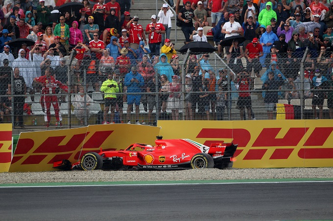

```{r setup, include=FALSE}
knitr::opts_chunk$set(cache = TRUE, message = FALSE, warning = FALSE)
```

## Overview {data-background-video="background.mp4"}

Analizzeremo:

>* Posizione dei circuiti 
>* Era turbo-ibrida
>* Campionato 2018
>* Hockenheim 2018

```{r, echo=FALSE}
library(readr)
library(dplyr)
library(tidyr)
library(ggplot2)
library(modelr)
library(tidyverse)
library(gganimate)
library(sf)
library(plotly)
library(rnaturalearth)
library(rnaturalearthdata)
library(maps)
library(mapdata)
library(grid)
library(rworldmap)


circuits = read_csv("csv/circuits.csv")
constructor_results = read_csv("csv/constructor_results.csv")
constructor_standings = read_csv("csv/constructor_standings.csv")
constructors = read_csv("csv/constructors.csv")
driver_standings = read_csv("csv/driver_standings.csv")
drivers = read_csv("csv/drivers.csv")
lap_times = read_csv("csv/lap_times.csv")
pit_stops = read_csv("csv/pit_stops.csv")
qualifying = read_csv("csv/qualifying.csv")
races = read_csv("csv/races.csv")
results = read_csv("csv/results.csv")
seasons = read_csv("csv/seasons.csv")
status = read_csv("csv/status.csv")

```


## Circuiti

<section>
<br>
```{r, echo=FALSE}

world <- ne_countries(scale = "medium", returnclass = "sf")
#class(world)

lat_cir = c(26.0325, 44.3439, 37.2270, 41.5700, 43.7347, 40.3725, 43.2506, 47.2197, 52.0786, 47.5789, 50.4372,52.3888, 45.6156, 43.4057, 1.2914,34.8431,30.1328,19.4042,-23.7036,-37.8497,21.5433,24.46720)
lng_cir = c(50.5106, 11.71670, -8.62670, 2.261110, 7.42056,49.8533, 5.791670, 14.7647,-1.016940, 19.2486, 5.97139, 4.54092, 9.28111, 39.9578, 103.864,136.541,-97.6411,-99.0907,-46.6997,144.968,39.1728,54.603100)

all_sites <- data.frame(longitude = circuits$lng, latitude = circuits$lat)
sites <- data.frame(longitude = lng_cir, latitude = lat_cir)

ggplot(data = world) +
    geom_sf() +
    geom_point(data = all_sites, aes(x = longitude, y = latitude), size = 3, shape = 23, fill = "darkred") +
    xlab("Longitude") + ylab("Latitude") +
    ggtitle("Mappa dei circuiti") 

```
</section>

<section>
<br>
```{r, echo=FALSE}
#circuiti di questa stagione (2021)

ggplot(data = world) +
    geom_sf() +
    geom_point(data = sites, aes(x = longitude, y = latitude), size = 3, shape = 23, fill = "darkred") +
    xlab("Longitude") + ylab("Latitude") +
    ggtitle("Mappa dei circuiti 2021")

```
</section>

<section>
<br>
```{r, echo=FALSE}
world <- ne_countries(scale = "medium", returnclass = "sf")

lat_circ = c( 44.3439, 37.2270, 41.5700, 43.7347, 43.2506, 47.2197, 52.0786, 47.5789, 50.4372,52.3888, 45.6156, 43.4057 )
lng_circ = c( 11.71670, -8.62670, 2.261110, 7.42056, 5.791670, 14.7647,-1.016940, 19.2486, 5.97139, 4.54092, 9.28111, 39.9578)

ue_sites <- data.frame(longitude = lng_circ, latitude = lat_circ)

ue <- st_crop(world, xmin = -20, xmax = 45, ymin = 30, ymax = 73)
ggplot() + geom_sf(data = ue) + theme_bw()+
    geom_point(data = ue_sites, aes(x = longitude, y = latitude), size = 3, shape = 23, fill = "darkred") +
    xlab("Longitude") + ylab("Latitude") +
    ggtitle("Circuiti europei")


```
</section>

## Era turbo-ibrida
<section>
<br>
```{r, echo=FALSE}

costruttori <- merge(merge(constructor_standings, races, by ="raceId"), constructors, by="constructorId")

#ANNATE

testa = 4

cons10 <- costruttori %>% 
  filter( year == 2010) %>% 
  filter( round == 19) %>% 
  arrange(desc(points)) %>% 
  head(testa) %>% 
  select(points, position , wins, year,round, name.x ,constructorRef)

cons11 <- costruttori %>% 
  filter( year == 2011) %>% 
  filter( round == 19) %>% 
  arrange(desc(points)) %>% 
  head(testa) %>% 
  select(points, position , wins, year,round, name.x ,constructorRef)

cons12 <- costruttori %>% 
  filter( year == 2012) %>% 
  filter( round == 20) %>% 
  arrange(desc(points)) %>% 
  head(testa) %>% 
  select(points, position , wins, year,round, name.x ,constructorRef)

cons13 <- costruttori %>% 
  filter( year == 2013) %>% 
  filter( round == 19) %>% 
  arrange(desc(points)) %>% 
  head(testa) %>% 
  select(points, position , wins, year,round, name.x ,constructorRef)

cons14 <- costruttori %>% 
  filter( year == 2014) %>% 
  filter( round == 19) %>% 
  arrange(desc(points)) %>% 
  head(testa) %>% 
  select(points, position , wins, year,round, name.x ,constructorRef)

cons15 <- costruttori %>% 
  filter( year == 2015) %>% 
  filter( round == 19) %>% 
  arrange(desc(points)) %>% 
  head(testa) %>% 
  select(points, position , wins, year,round, name.x ,constructorRef)

cons16 <- costruttori %>% 
  filter( year == 2016) %>% 
  filter( round == 21) %>% 
  arrange(desc(points)) %>% 
  head(testa) %>% 
  select(points, position , wins, year,round, name.x ,constructorRef)

cons17 <- costruttori %>% 
  filter( year == 2017) %>% 
  filter( round == 20) %>% 
  arrange(desc(points)) %>% 
  head(testa) %>% 
  select(points, position , wins, year,round, name.x ,constructorRef)

cons18 <- costruttori %>% 
  filter( year == 2018) %>% 
  filter( round == 21) %>% 
  arrange(desc(points)) %>% 
  head(testa) %>% 
  select(points, position , wins, year,round, name.x ,constructorRef)

cons19 <- costruttori %>% 
  filter( year == 2019) %>% 
  filter( round == 21) %>% 
  arrange(desc(points)) %>% 
  head(testa) %>% 
  select(points, position , wins, year,round, name.x ,constructorRef)

cons20 <- costruttori %>% 
  filter( year == 2020) %>% 
  filter( round == 17) %>% 
  arrange(desc(points)) %>% 
  head(testa) %>% 
  select(points, position , wins, year,round, name.x ,constructorRef)

#--------------------
finalcons <-rbind(cons10, cons11, cons12, cons13, cons14, cons15, cons16, cons17, cons18, cons19, cons20)

ggplot(finalcons, aes(x = year, y = points, color = constructorRef)) +
  geom_point(size = 3)+
  geom_line(linetype = "dashed", size = 0.90)+
  scale_x_continuous("year", breaks = c(2010,2012,2014,2016,2018,2020))
  

```
</section>
## Campionato 2018

<section>
<br>
```{r, echo=FALSE}
#join e tabella filtrata
campionato <- merge( merge(driver_standings, races, by = "raceId"), drivers, by = "driverId")
camp2018 <- campionato %>% 
  select(points, position, wins, year, round, name, date, driverRef)  %>% 
  filter(year == 2018) %>% 
  arrange(round)

#plottiamo i risultati
ggplot(camp2018, aes(x = round, y = points, color = driverRef)) +
  geom_point()+
  geom_line(linetype = "dashed")

```
</section>

<section>
<br>
Hamilton vs Vettel
```{r, echo=FALSE}
 
risGare <- merge( merge( merge( merge(results, races, by = "raceId"), drivers, by = "driverId"), constructors, by = "constructorId") , status, by = "statusId")

camp2018 %>% 
  filter(driverRef == c("hamilton", "vettel")) %>% 
  ggplot(aes(x = round, y = points, color = driverRef)) +
    geom_point() +
    geom_line(linetype = "dashed") +
    scale_y_continuous("points", breaks = c(0,50,100,150,200,250,300,350,400)) +
    scale_x_continuous("round", labels = round, breaks = c(0,1,2,3,4,5,6,7,8,9,10,11,12,13,14,15,16,17,18,19,20,21)) 

```
</section>

<section>
  <br>
  
</section>

<section>
<br>
Linear regression
```{r, echo=FALSE}

lr2018 <- camp2018 %>% 
  filter(driverRef == c("hamilton", "vettel")) 
modPTRO = lm(points ~ round, data = lr2018)

# plot observed and predicted values
lr2018 = add_predictions(lr2018, modPTRO) 
ggplot(lr2018, aes(x = round, y = points, color = driverRef)) +
  geom_point(aes(y = points)) + # observed values
  geom_line(aes(y = pred), colour = "red") # predicted values
```
</section>

<section>
<br>
Mettiamo a grafico i residui
```{r, echo=FALSE}

# add and plot residuals
lr2018 = add_residuals(lr2018, modPTRO)
ggplot(lr2018, aes(round, resid)) + 
  geom_ref_line(h = 0) +
  geom_point()
```
</section>

## Fine 
<br>
Grazie dell'attenzione


